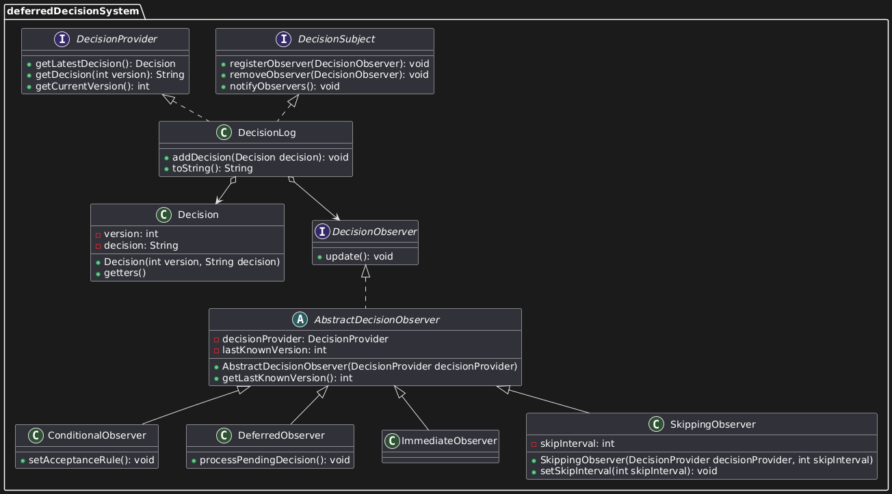

# Deferred Decision System (Temporal Observer Pattern)

## Problem Space
Most Observer implementations assume an immediate reaction to a state change. This project will explore what happens when observers are intended to not react instantaneously but rather react at any time defined.
In this project we will have a system that produces decisions, Observers choose when and how to react.
The subject won't know when observers react or which updates they care about.

More specifically there will be observers which will act as follows:
- Ignore updates unless defined explicitly at runtime.
- Process updates now.
- Process updates later, based on a pre-determined rule.

Observers will be responsible for their own rules and the subject is not aware about what observers do.

To keep complexity low, the subject will only maintain two values, a version number and a String.

## Overview
Implementation of a Temporal Observer Pattern, which dictates how updates are executed based on pre-determined rules or run-time activation. To keep the logical complexity of the project low, I have implemented a bare-bones `Decision` class which is responsible for holding only an int and a String. The observers will utilize state changes to these fields in different ways. The concrete subject `DecisionLog` is responsible for standard subject functionality and also providing state information outside the standard notifyObservers() method. This is required to maintain a temporal decoupling, since not all observers will receive updates via standard means. 

All observers inherit the `DecisionObserver` interface, which simply defines an update() method. The `AbstractDecisionObserver` is used by all observers to provide access to a `DecisionProvider`. As stated above, this is required to maintain temporal de-coupling. Notifications occur immediately, but observers control when or if they accept updates, allowing them to skip intermediate changes using the `DecisionProvider`.

The goal of the project is to show how observers can demonstrate a different interpretation of "reacting to change".

## Design Patterns Used
**Temporal Observer Pattern**

- Observers register with a subject.
- Subject notifies observers when its state changes.
- Observers choose how to react.
- Loose coupling between subject and observers.
- Observer logic can be deferred or instantaneous.

## UML Diagram

## Project Structure
- `DecisionLog` - Concrete subject maintaining an "evolving" value.
- `ImmediateObserver` - Concrete observer that processes a change instantly.
- `DeferredObserver` - Concrete observer that processes a change when triggered externally.
- `ConditionalObserver` - Concrete observer that pulls and tests the value against a rule. Accepts only if the rule is passed, discards otherwise.
- `SkippingObserver` - Concrete observer that tests against an internal rule. Accepts updates only at specific intervals based on its internal rule; otherwise, skips them.

## How to Run
1. Clone the repository
2. Compile the project
3. Run `deferredDecisionSystemClient/Main.java`