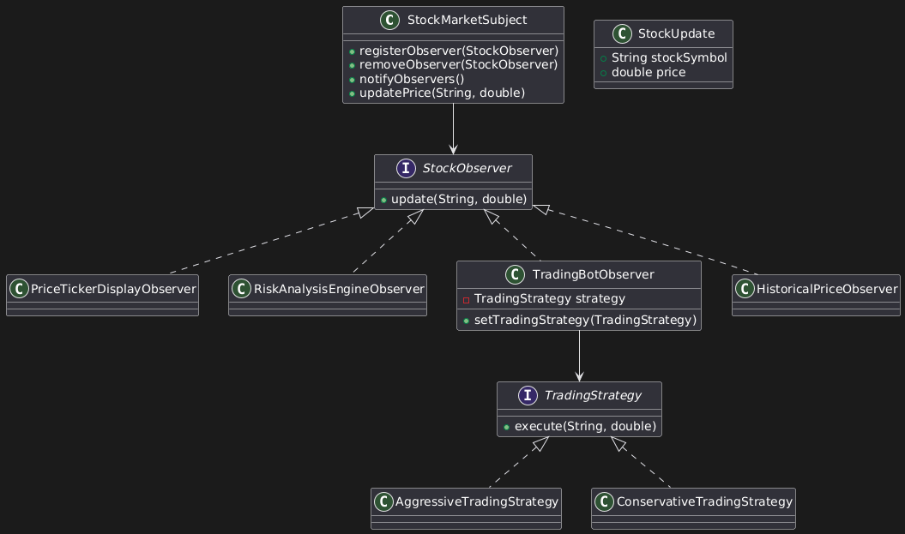

# Stock Trading System (Observer Pattern)

## Overview
This project is a Java-based implementation of the Observer design pattern,
inspired by the example from *Head First Design Patterns*.

In this project the observer pattern is combined with the strategy pattern to create a simplified stock trading platform.
Various information is tracked/stored/evaluated via observers and trading strategies can be adjusted at run-time to alter performance.
All state information comes from the `StockUpdate` class, which holds the state of the most recent stock changes. This information is then fed to the only concrete subject `StockMarketSubject`.
From here all subscribed observers will be updated with a `StockUpdate` object containing the sign and value of the stock, and a `StockSubject` object which is a concrete subject.

The `StockSubject` object can contain within it various methods and/or fields that may be relevant to subscribed observers. This means that the observer pattern is a middle-ground of a push and pull type observer system. 
This design choice has been made since I have operated under the assumption that observers will react differently, their behaviors can change at run-time and attempting to maintain the open-closed principle is important.
This has created a drawback in the access to which observers have to irrelevant information, but this drawback is made intentionally to maintain the open-closed principle. To make this drawback clear within the project, I have intentionally
not used the `StockSubject` object at all in any of the concrete observers. I have implemented it this way to showcase that a design choice was made to allow for easy implementation of observers which may make use of the `StockSubject`
object in future development. By not doing so, the open-closed principle would be violated.

The `tradingStrategy` package includes two strategies which are simplistic in nature. I decided to implement this design pattern into the project since stock trading typically relies an a multitude of strategies. Implementing real
trading strategies was not a goal of this project, but one can imagine that such strategies would be found in this package. 

## Design Patterns Used
**Observer Pattern (Hybrid Push-Pull Model) and Strategy Pattern**

- Observers register with a subject
- Subject notifies observers when its state changes
- Observers get relevant and irrelevant information (hence hybrid push-pull)
- Loose coupling between subject and observers
- Stock trading strategies can be decided at run-time

## UML Diagram

## Project Structure
- `StockSubject` – Interface defining observer management and other relevant methods/fields (see overview)
- `StockObserver` – Interface for receiving updates
- `StockMarketSubject` – Concrete subject storing price updates and observer management
- `StockUpdate` – Hypothetical API used to store state of the latest stock changes

## How to Run
1. Clone the repository
2. Compile the project
3. Run `stockTradingClient/Main.java`