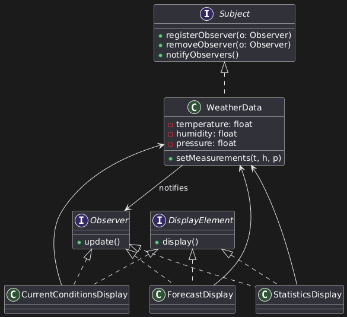

# Weather Monitoring System (Observer Pattern)

## Overview
This project is a Java-based implementation of the Observer design pattern,
inspired by the example from *Head First Design Patterns*.

The system models a weather station `WeatherDataSubject` that automatically notifies
multiple display elements when weather measurements change.

## Design Pattern Used
**Observer Pattern (Pull Model)**

- Observers register with a subject
- Subject notifies observers when its state changes
- Observers pull only the data they need
- Loose coupling between subject and observers

## UML Diagram

## Project Structure
- `Subject` – interface defining observer management
- `Observer` – interface for receiving updates
- `WeatherDataSubject` – concrete subject storing weather measurements
- `CurrentConditionsDisplayObserver` – shows current temperature and humidity
- `StatisticsDisplayObserver` – shows min/avg/max temperature
- `ForecastDisplayObserver` – predicts weather based on pressure trends

## How to Run
1. Clone the repository
2. Compile the project
3. Run `WeatherStation.java`