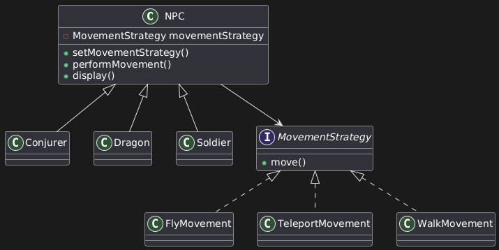

# AI Movement (Strategy Pattern)

## Overview
The strategy pattern is used to define various means of movement that an NPC may have. Movement can be changed at runtime by switching strategies. The project is kept logically simple to showcase the
strategy pattern, so movement is defined by strings printed to the console. 

## Design Patterns Used
**Strategy Pattern**

- MovementStrategy interface defines movement
- Concrete movements inherit and build upon the interface
- Context classes contain reference to movement strategies allowing them to be altered at run-time

## UML Diagram

## Project Structure
**contextNPC**
Contains the abstract class `NPC` which stores a `MovementStrategy` field parameter and defines methods to set and perform movement. The strategy can be changed dynamically.
All other classes extend NPC with hard-coded strategies, although these are transitively dynamic (since `NPC` defines the dynamic behavior.)

**movementStrategy**
- Contains the `MovementStrategy` interface and its implementations:
  - `FlyMovement`
  - `TeleportMovement`
  - `WalkMovement`

**clientAIMovement**
	- Contains the `Main` class, which demonstrates the usage of the Strategy pattern by assigning different movement strategies, altering and performing those movements.

## How to Run
1. Clone the repository
2. Compile the project
3. Run `clientAIMovement/Main.java`